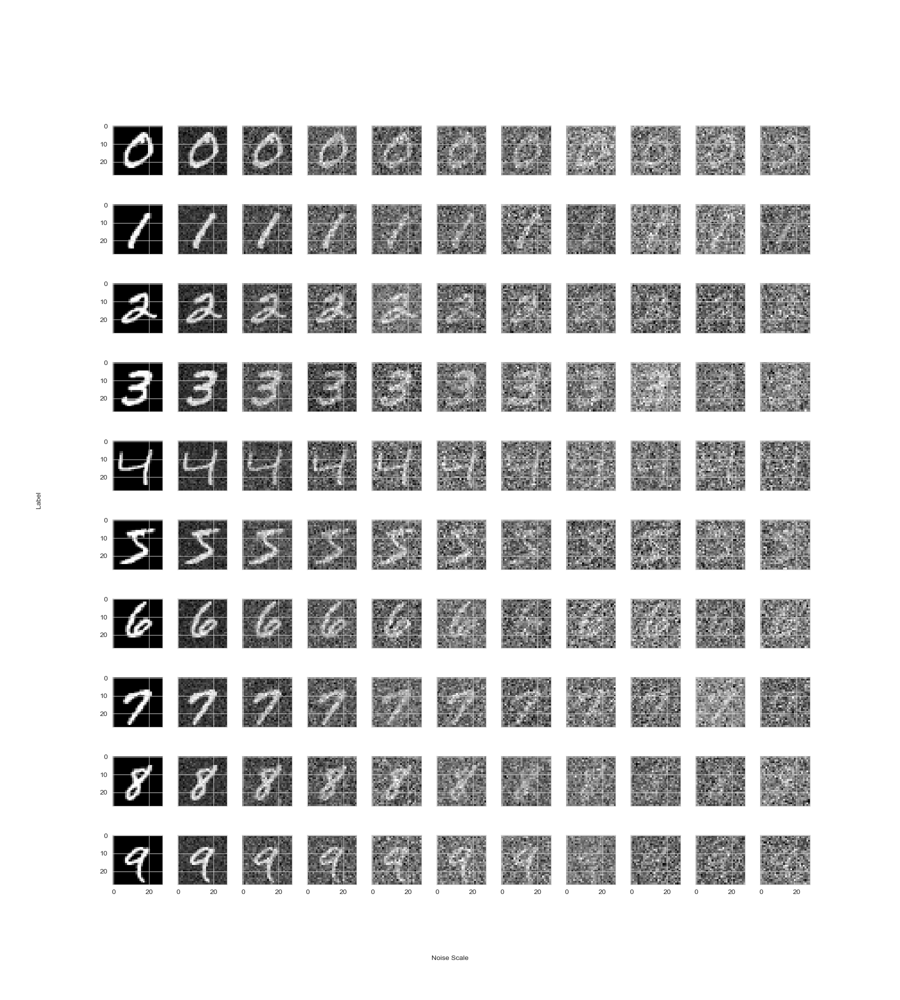
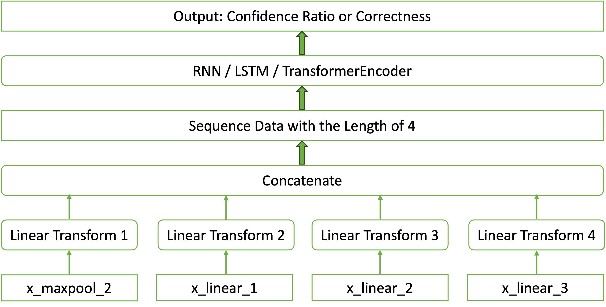

# Activation Analysis
## 1. Introduction
### 1.1 What We Are Doing?

We are trying to evaluate the quality of a model's prediction by another neural network(noted as meta-network). This task can be applied in scenarios that require real-time assessment of a model's output, such as autonomous driving. In such contexts, it's crucial to evaluate the reliability of the model's instantaneous output to make appropriate decisions.

### 1.2 Two Tasks 
We split the problem into two tasks, one is the regression task and the other is classification task. The two tasks evaluate the quality of the output of a model given the input from different perspectives.
#### 1.2.1 Regression Task
One way to measure the quality of the model's output is the robustness. If the model's prediction is robust against strong random noise, we can say such a model is 'confident' on such a prediction. In fact, a good (robust) machine learning model should make consist prediction when facing noise.

Therefore, we use gaussian random noise to disturb the images and calculate the ratio of times when the model does not change its prediction on the noised images. Detail steps are shown in part 2.2. The higher the ratio, the more robust the model’s behavior is on related images. 

In regression task, we try to train a meta-network to predict the confidence ratios of the given models and given images.
### 1.2.2 Classification Task
Another way to measure the quality of the prediction from the tested model is the correctness. The wrong prediction absolutely is not so good as the right prediction. In this task, we do not need to generate labels like what we do in the regression task. We only need to train a meta-network to prediction the correctness of the tested model's output.

## 2. Data Preparation

To simplify the discussion, **we only consider to evaluate the prediction from classification models (such as LeNet on MNIST dataset) in this project**. Part 2.1 will show the intuition behind the design of the input data for training our meta-network, while part 2.2 will discuss how to generate labels for training our meta-network in the regression task (How to generate the confidence ratio for each prediction). 

### 2.1 Composition of Inputs

To train our meta-network, the input should be consist of the following two components:

1. Data flow (Required, directly shows the transformations of the input images between each layers)
2. Information of the network being tested (Optional)

If we do not include the data flow in the input, the task will turn to evaluate a performance of a given neural network, since a fixed network always has difference confidences for different input samples.

The structure and weight of the network completely determine the transformation process of an input sample in the network, so the information of the network may not be necessary from the information theory point of view. 

However, we cannot guarantee that our evaluating newtork will fully use information from the data flow. Therefore, maybe we should also consider the information of the testing network as a part of our input. 

### 2.2 Design of the Label in the Regression task

It is hard to know the exact ratio of unchaged prediction from the tested model (LeNet) when the input images are disturbed by random noise. The solution is to use sampling method to approximate the confidence ratio. Here are the steps

1. Add a random perturbation to a sample to generate several new samlpes.
2. Get predictions of those new samples.
3. Calculate how many percent of the predictions are different with the original one or the KL-divergence of the softmax outputs.

In our practice, when the number of the generated psudo samples is larger than 100, the approximated ratio will converge. To make the approximation more accurate, for each image, we generate 1,000 noised images to calculate the ratio.

### 2.3 Examples

In this project, we use `LeNet5` as the model being tested, `MNIST-10` as the input data for those models. More specifically:

1. We train thousands of `LeNet5`s with different hyper-parameter settings.
2. For each model, we select 200 samples from the test set of `MNIST-10`.
   - Each digit has 20 selected samples
   - 10 for right predictions and 10 for wrong predictions
   - some models (too bad or too good) might not allow us to select enough samples
3. For each model-sample pair (ideally, a model will have 200 pairs), we add random noise to the image sample respectively, then calculate how many percent of the predictions are not changed by the noise. We use the ratio as the lable for our meta-network training in the regression task. 
4. Because of the limitation of memory, we are not able to involve the whole parameter set of `LeNet`s and the whole data flow of each prediction together into the training’s input. Therefore, we only use the last four layers’ outputs of `LeNet`s (the outputs of the second maxpooling layer, and the remaining three linear layers) in the dataset.

> In our experiments, we use random noise with `scale`=0.9, which means that the noised images are generated in the following ways:
> $$
> \text{noised image} = \text{original image} + 0.9 \epsilon,\quad \epsilon \sim N(0, I)
> $$

Here is the examples of generated images with different scales:



## 3. Design of Our Meta-Networks

Since the last four layers’ output of `LeNet`s  could be regarded as a kind of sequence data, we apply the following three structures to design our meta-network.

1.  RNN
2. LSTM
3. TransformerEncoder

Those three structures are commonly used in processing sequence data. However, they can only process sequence data with the same number of the dimension, which conflicts with the format of our data. For example, the size of the output of the second maxpooling layer of `LeNet`s is $16\times 16$, while the size of the output of the first linear layer of `LeNet`s is $120\times 1$.

To address the above conflict, we apply 4 different linear transformations on the outputs of the last four layers of `LeNet`s so that they will become in the same size. After that, we use the above three kinds of neural networks to process the fixed sequence data and generate the evaluation of the data flow. Here is a picture that shows the overall structure of our meta-network.



## 4. How to Re-prodcue Our Result

### 4.1 Train thousands of LeNet-5 models with different hyper-parameter settings.
Run the following command in the terminal:
```shell
python TrainLenet.py
```
This command will generate more than 4,000 LeNets with different hyperparameters and accuarcy >= $60\%$.

### 4.2 Sample images for each trained LeNet-5 model and generate the `ratio` label for each model-image pair.
Run the following command in the terminal:
```shell
python DataPreparation.py
```
This script will sample about 200 digit images for each model in directory `models` into the directory `model_sample`. Each model will be assigned:
- 100 samples classified correectly, each class with 10 samples.
- 100 samples classified incorrectly, each class with 10 samples.

Then, run the following command:
```shell
python gen_pair.py
```
This will generate files in the following directories:
1. `pair_9_10/`: Containing models' weight, sampled images, data flow during the inference, ratio (represente the confidence of the prediction), type(correct prediction or wrong prediction).
2. `pair_9_10_npy/`: Containing the last four layers' output of the model given the images: `x_maxpool2`, `x_fc1`, `x_fc2`, `x_fc3`, ratio (represente the confidence of the prediction), type(correct prediction or wrong prediction).
3. `pair_9_npy`: Containing 1/10 data in `pair_9_10_npy/`.
### 4.3 Train meta-networks to predict the confidence or correctness of the prediction from given LeNet-5 and images.
We provide three kinds of Meta-Networks:
1. RNN based
2. LSTM based
3. TransformerEncoder based

The following .sh files will train those models with random seed as 1,2,3,4,5:
1. `train_rnn.sh`
2. `train_lstm.sh`
3. `train_transformer.sh`

> If your computer is not mac with m-chips, please remove `--device mps` from the above three `.sh` files and add `--device cuda` if your computer is equipped with Nvidia GPU.

The training logs can be seen in `log/`. The training result can be seen in `results/`. 

Overall, 
1. The best reg model is lstm based. It model can achieve $r^2>0.77$.
2. The best classification model is rnn based. It can achieve accuracy $>0.91$.